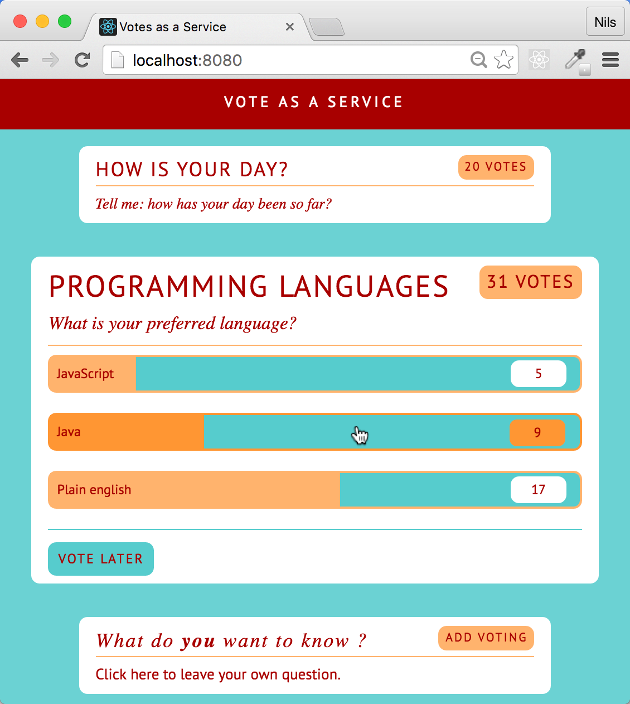

# Vote Example (React Buch)
This repository contains the sample universal web application "Vote as a Service" from the German Book on React "[React - Die praktische Einführung in React, React Router und Redux](https://www.dpunkt.de/buecher/5542/9783864903274-react-12388.html)" by [Nils Hartmann](http://nilshartmann.net) and [Oliver Zeigermann](http://zeigermann.eu).

# Contributions and Feedback
If you have any ideas for improvement, discover bugs or just want to give feedback, don't hesitate to open an [issue](https://github.com/reactbuch/vote-example/issues)
or [pull request](https://github.com/reactbuch/vote-example/pulls) in this repository.

# More Informations
You can find more informations about the react book here: http://reactbuch.de (in german).

